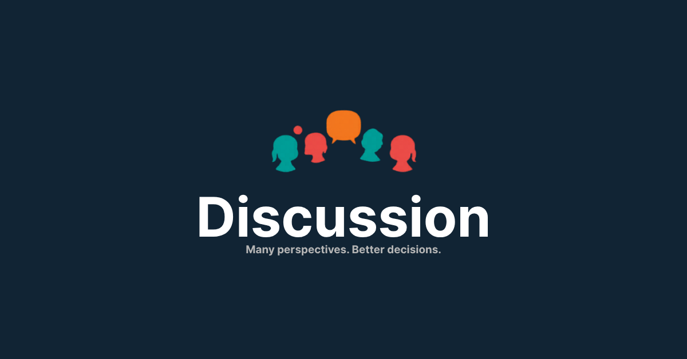

<p align="center">
  
</p>

<h1 align="center">Discussion Panel</h1>

<p align="center">
  <strong>Multi-perspective analysis skill for Claude Code</strong><br>
  Break free from confirmation bias. Get fresh eyes on every decision.
</p>

<p align="center">
  <a href="#installation">Install</a> &bull;
  <a href="#usage">Usage</a> &bull;
  <a href="#modes">Modes</a> &bull;
  <a href="#output-format">Output</a> &bull;
  <a href="#how-it-works">How it works</a> &bull;
  <a href="#examples">Examples</a>
</p>

---

## The Problem

When you work 1-on-1 with an AI for a long session, dangerous patterns emerge:

- **Confirmation drift** - the AI adapts to your framing and stops pushing back
- **Tunnel vision** - you only see what's already been discussed
- **Band-aid fixes** - surface patches instead of root-cause solutions
- **Unchallenged assumptions** - wrong premises survive because nobody re-examines them

## The Solution

`/discussion` spawns **independent sub-agents with fresh context** who analyze your topic from different perspectives. They have no stake in your current conversation's conclusions.

Each panelist uses a different **cognitive framework** (Pre-mortem, First Principles, Steel-man inversion, etc.) and receives a **different view of the facts** — so even though they're the same model, their thinking genuinely diverges.

## Requirements

- **Claude Code** (CLI, Desktop App, or IDE extension)
- **Claude Pro / Max / Team / Enterprise plan** (sub-agents require the Agent tool)
- Standard mode spawns 2 agents, Full spawns 4, Extrafull spawns 5

## Installation

```bash
git clone https://github.com/ino461x/discussion-panel.git
```

Copy the skill directories into your project's `.claude/skills/` folder:

```bash
# From your project root
mkdir -p .claude/skills
cp -r discussion-panel/skills/discussion .claude/skills/
cp -r discussion-panel/skills/panel .claude/skills/
```

Both `/discussion` and `/panel` invoke the same skill — `panel` is simply a shorter alias for convenience.

## Usage

```
/discussion Should we migrate from REST to GraphQL?
/panel Is this the right database schema?
```

That's it. The skill will assess the topic's weight and ask you to configure the panel:

**Q1: Scale** - How many panelists?

| Standard | Full | Extrafull |
|----------|------|-----------|
| 2 panelists | 4 panelists | 5 panelists |
| Critic, Realist | + Architect, Outsider | + Contrarian |
| Quick check | Design decisions | High-stakes calls |

**Q2: Model** - What quality level?

| All Sonnet | Balanced | All Opus |
|------------|----------|----------|
| Fast & cheap | Best cost/quality | Maximum depth |
| All panelists use Sonnet | Key roles use Opus | All panelists use Opus |

For light topics, it just runs without asking.

## Modes

Each panelist has a **cognitive framework** and a **Starting Artifact** — a mandatory thinking exercise completed before producing findings. This forces genuine divergence from the same underlying model.

### Standard (2 panelists)

| Role | Focus | Framework | Starting Artifact |
|------|-------|-----------|-------------------|
| **Critic** | Assumptions, risks, alternatives | Pre-mortem + 5 Whys | Write 3 failure scenarios first |
| **Realist** | Cost, maintenance, simpler paths | Cost-benefit estimation | Estimate effort in person-days |

### Full (4 panelists)

Adds:

| Role | Focus | Framework | Starting Artifact |
|------|-------|-----------|-------------------|
| **Architect** | Root causes, systemic effects, missed synergies | First Principles | Map the dependency chain first |
| **Outsider** | Unnecessary complexity, "why not just...?" | Beginner's Mind | Name a non-software domain that solved this |

### Extrafull (5 panelists)

Adds:

| Role | Focus | Framework | Starting Artifact |
|------|-------|-----------|-------------------|
| **Contrarian** | Strongest case for the **opposite** approach | Steel-man inversion | Describe what was built in a world where this approach was never proposed |

### Differentiated Input

Each panelist receives a **different view** of the same facts:

| Panelist | Information view |
|----------|-----------------|
| Critic | All facts + implicit assumptions highlighted |
| Realist | All facts + technical & business constraints highlighted |
| Architect | All facts + dependency/structural info highlighted |
| Outsider | **Topic and stakes ONLY** (intentional blank slate) |
| Contrarian | All facts + user's argument placed prominently |

This means even with the same model, panelists analyze from genuinely different starting points.

## Output Format

Each panelist produces:
1. **Starting Artifact** (the thinking exercise)
2. **Reasoning chain** (150-200 words developing their key insight)
3. **1-3 findings** with severity ratings

Results are synthesized into:

| Section | Content |
|---------|---------|
| **Summary** | Consensus, tensions, and discoveries |
| **Reasoning Highlight** | The single most compelling reasoning chain, quoted verbatim |
| **Findings Table** | All findings sorted by severity (CRITICAL > HIGH > MEDIUM > LOW) |
| **Collision Analysis** | Where panelists contradicted each other — and what third conclusion follows |

Severity definitions:

| Severity | Meaning |
|----------|---------|
| **CRITICAL** | Blocks progress or causes failure if ignored |
| **HIGH** | Significant risk or missed opportunity |
| **MEDIUM** | Worth considering but not urgent |
| **LOW** | Minor improvement or nitpick |

## How It Works

```
1. Context Extraction
   Facts are categorized: technical constraints, business constraints,
   user behavior, and implicit assumptions. The user's reasoning is
   preserved as an attackable target, not stripped away.

2. Information Distribution
   Each panelist receives a DIFFERENT view of the facts.
   Outsider gets only topic + stakes (blank slate).
   Contrarian gets the user's argument front and center.

3. Starting Artifact
   Before analyzing, each panelist completes a mandatory thinking
   exercise (failure scenarios, cost estimates, dependency maps, etc.)
   Their findings must emerge FROM this exercise.

4. Deep Reasoning
   Each panelist develops their key finding in 150-200 words,
   following the logic step by step. No jumping to conclusions.

5. Synthesis + Collision Analysis
   Results are compiled, then contradictions between panelists are
   examined: "If both are right, what third conclusion follows?"
   Emergent insights live at these intersections.

6. Facilitation
   You decide which points to act on. The panel informs, not dictates.
```

## Examples

### Architecture Review

```
/discussion full Is our routes layer too fat?
```

> **Reasoning Highlight** (Architect):
> *"Drawing the dependency chain reveals the real problem isn't line count — it's that routes import repos directly, creating a hidden coupling layer. When I map what depends on what, 4 of 6 route files bypass the service layer entirely. This means any change to the data model requires touching both the repo AND every route that imports it. The 'fat routes' symptom is actually a dependency inversion violation..."*

> | # | Severity | Finding | Panelist |
> |---|----------|---------|----------|
> | 1 | CRITICAL | `handle_payment` has no transaction boundary — partial writes on failure | Architect |
> | 2 | HIGH | Routes import DB directly, bypassing service layer | Critic |
> | 3 | HIGH | Moving code to services just moves the fat — need to split by domain | Realist |
> | 4 | MEDIUM | Split routes by resource (users, orders, payments) like the existing auth module | Outsider |

> **Collision Analysis**:
> Critic said "routes bypass service layer" while Realist said "moving to services just moves the fat."
> If both are correct: the fix isn't extracting to services — it's splitting by domain first, THEN extracting.

## Flags

| Flag | Effect |
|------|--------|
| `--ctx` | Force codebase exploration (default ON for technical topics) |
| `--no-ctx` | Explicitly disable codebase exploration |

For technical topics (code, architecture, bugs), `--ctx` is **ON by default** — panelists will explore your codebase before analyzing, with role-specific exploration targets (Critic reads tests, Architect reads schemas, etc.).

## Honest Framing

These panelists are role-played perspectives from the same underlying model, not truly independent thinkers. They're valuable because:

- **Cognitive frameworks** force different thinking processes, not just different labels
- **Differentiated input** means each panelist literally sees different information
- **Starting Artifacts** make them think before they opine
- **Collision Analysis** extracts emergent insights from contradictions

They're **not** a substitute for actual peer review, domain expertise, or user testing.

## License

MIT
